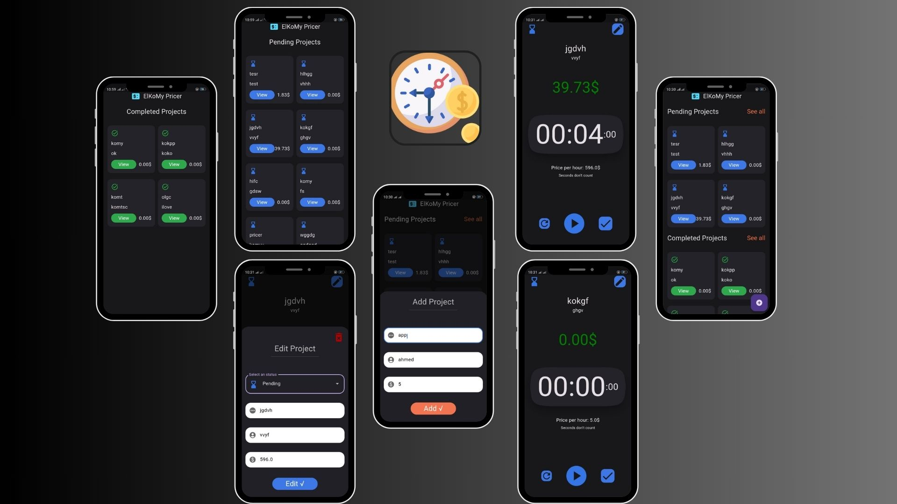

# My Apps Portfolio
Welcome to my Apps Portfolio! This repository showcases the various mobile applications I've developed. Each folder within this repository contains details about a specific app, including a brief description, key features, and a download link for the APK file.

## - [Notes App](./notes/README.md)
  

## - [Snap Text](./snap_text/README.md)

## - [Pricer](./pricer/README.md)

## - [Dimax - Real Estate](./dimax/README.md)

## Additional Apps
I have developed several other applications as part of my training with my teacher in a course. This demonstrate my skills and capabilities, But these apps are not included in this portfolio.

I am currently working on several other applications as part of my training, work and development process. These apps are still in progress and will be added to this portfolio once they are completed.

I will upload these apps to this repository once they are finished. Stay tuned for updates!

Thank you for visiting my portfolio! For any inquiries or further information, please feel free to contact me.

## Get in Touch
If you have any questions or feedback, feel free to reach out. I’m always open to discussing new ideas and collaborations.
