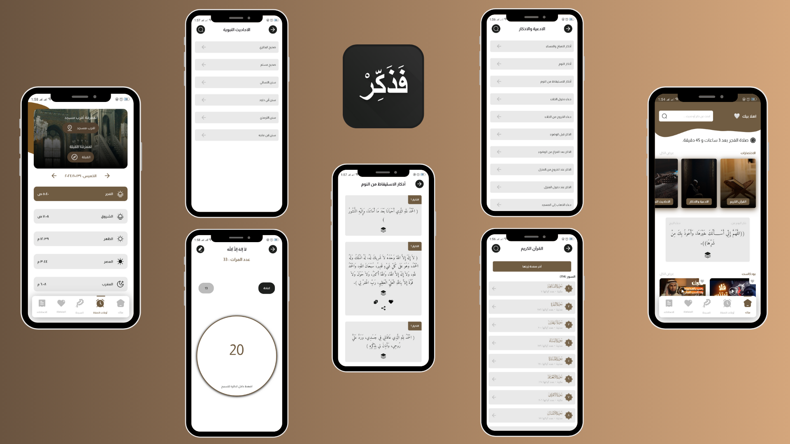

# Fazakir App - Comprehensive Islamic App

## Description

**Fazakir** is a holistic Islamic app designed to offer a wide range of religious and spiritual features for Muslim users. With a user-friendly interface and attractive design, this app provides valuable tools for users of all ages and religious levels, helping them strengthen their connection with faith.

## Features

- ### **Notifications - Tazkeer Reminders**
  - Customizable reminder notifications to inspire users with random Zikr (remembrances) at user-set intervals. For example, users can choose to receive a random Zikr every 5 minutes, serving as gentle reminders throughout the day to keep connected to their faith.

 - ### **Islamic Podcasts and Video Collection**
  - A curated collection of religious podcasts and videos on Islamic topics:
    - Includes insightful discussions on faith, spirituality, and Islamic teachings.
    - Users can listen to or watch high-quality content, enriching their understanding of Islam and offering valuable perspectives on daily life.

 - ### **The Holy Quran - Read & Advanced Search**
  - Full Quran text with intuitive reading and search capabilities:
    - Search by keywords, specific verses (Ayahs), page numbers, or Juzz (sections) to quickly find and navigate to specific content.
    - Supports an enhanced reading experience for ease of study and reflection on the Quranic text.

- ### **Prophetic Hadiths**
  - Provides verified Hadiths to:
    - Spread authentic teachings and rulings of Islam.
    - Correct misconceptions about Islam through authentic Prophetic sayings.
    - Instill Islamic values and ethics in users.

- ### **Ruquya (Islamic Healing)**
  - Offers guidance on performing legitimate Ruquya, which includes:
    - Recitation by a pious Muslim.
    - Clear, audible recitation with focus and reverence.
    - Consistent Ruquya practice for the user’s well-being.

- ### **Supplications and Remembrances**
  - A rich collection of Duas (supplications) and Adhkar (remembrances) for daily use, as they:
    - Bring users closer to God.
    - Provide peace and psychological comfort.
    - Protect against harm and negativity.
    - Grant blessings and prosperity.

- ### **Prayer Times**
  - Accurate prayer times with:
    - Precise schedules, allowing users to perform prayers on time.
    - Easy-to-use format, suitable for all tech skill levels.
    - Useful information on prayer practices, including conditions and performance guidelines.

- ### **Qibla Direction**
  - Accurate Qibla finder that guides users in finding the direction of the Kaaba:
    - Uses a compass in open areas to minimize obstructions.
    - Guidance on determining direction using celestial cues like the sun or moon if needed.

- ### **Digital Misbaha (Tasbeeh Counter)**
  - Digital prayer bead counter to assist with:
    - Tasbeeh: "SubhanAllah" (Glory be to Allah).
    - Tahmeed: "Alhamdulillah" (Praise be to Allah).
    - Takbeer: "Allahu Akbar" (Allah is the Greatest).
    - Salawat: Sending blessings upon Prophet Muhammad, peace be upon him.

## Download

You can download the Simple Notes app using the link below:

[Download Fazakir App APK](https://www.mediafire.com/file/s059zfjzcyyc5nr/fazakir.apk/file)
