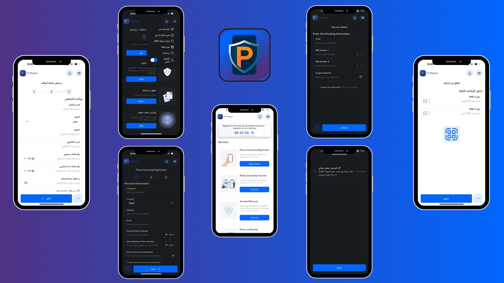

# P-Phone – Device Ownership

## Description

P-Phone is a privacy-first Flutter application designed to help users protect and verify the ownership of their mobile devices. The app offers critical features like reporting lost or stolen devices, ownership transfer, and real-time verification — all without collecting unnecessary personal data.

## Features

### General Features
- **User Authentication**: Secure login using Supabase with optional biometric authentication.
- **User Profile Management**: Allows users to link their identity with the device using secure forms and device metadata.
- **Responsive UI**: Adaptive design for both Android and iOS platforms.

### Ownership Management
- **Verify Device Ownership**: Users can register their device and validate ownership using QR codes and backend checks.
- **Transfer Ownership**: Safely hand off a device to another user by transferring registration and linked data.
- **Report Lost Devices**: Mark a device as lost and notify others through the verification system.

### Utility Tools
- **QR Code Scanning**: Scan QR codes for quick ownership checks using `mobile_scanner`.
- **OCR Text Recognition**: Extract and verify text from documents using Google ML Kit’s OCR.
- **Theme & Language Settings**: Persist user preferences with `HydratedCubit`.

### Notifications & Support
- **Push Notifications**: Receive updates about your device’s ownership and status.
- **In-App Support**: Integrated Crisp chat support for direct assistance.
- **Crash Reporting**: Firebase Crashlytics integration for stability monitoring.

## Architecture & Tech Stack

- **Flutter + Dart**: Core UI and logic
- **Supabase**: Authentication, real-time DB, Edge Functions
- **Cloudinary**: Media storage and optimization via Supabase Edge Function
- **Cubit / HydratedCubit**: Scalable state management
- **Firebase Crashlytics**: Crash monitoring
- **Mobile Scanner**: QR & barcode scanning
- **Google ML Kit**: OCR (text recognition)
- **Deep Linking**: Seamless navigation from external links
- **Pagination Manager**: Custom pagination package [My own package published on pub.dev](https://pub.dev/packages/pagination_manager)

## Download

You can download the P-Phone app using the link below:

[Download from Play Store](https://play.google.com/store/apps/details?id=com.pphoneapp)
[Download from App Store](https://apps.apple.com/us/app/pphone/id6749025787)
