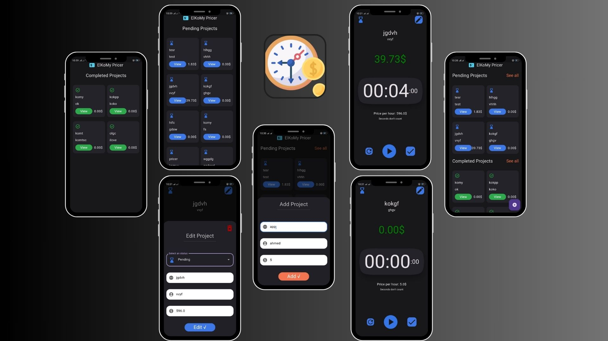

# Pricer

## Description

Pricer is a powerful and intuitive app designed to help freelancers manage their projects and calculate their hourly rates effortlessly. With Pricer, you can automate price calculations, track project statuses, and ensure that you stay organized with a sleek and user-friendly interface.

## Features

- **Automated Pricing**: Calculate project costs based on hourly rates and time spent automatically.
- **Project Management**: Track the status of your projects with options for pending and completed statuses.
- **Customizable Rates**: Set and adjust your hourly rates for different types of work or clients.
- **User-Friendly UI**: Enjoy a modern and clean interface that makes project management simple and effective.

## Download

You can download the Pricer app using the link below:

[Download Pricer APK](./pricer.apk)
